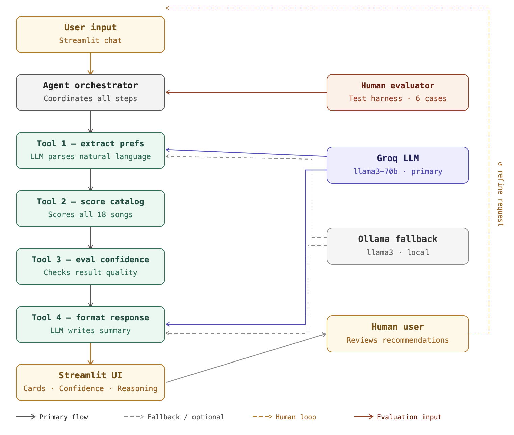

# 🎵 TuneFit 2.0
### Conversational Agentic Music Recommender


---

## Overview

TuneFit 2.0 transforms a hand-coded scoring engine into a fully conversational AI system. Instead of asking users to fill in structured preference forms, it accepts natural language — "something chill for late-night studying" — and uses an LLM to extract structured music preferences before scoring them against a catalog of 18 songs. What makes it interesting as an applied AI system is the explicit separation of concerns: the LLM handles language understanding and response generation, while the original deterministic scoring engine handles actual ranking — so the system is auditable, and the LLM cannot hallucinate a recommendation. The full reasoning chain — what the agent extracted, what it scored, how confident it is — is surfaced in the UI, making the decision process transparent rather than a black box.

---

## Built on TuneFit 1.0

This project extends TuneFit 1.0, my Module 1–3 project — a CLI music recommender that scored 18 songs against a user taste profile using content-based filtering. TuneFit 1.0 scored each song across seven dimensions (genre, mood, energy, acousticness, valence, danceability, and tempo) and returned the top 5 matches with a plain-language explanation for each. Five user profiles were tested, revealing a structural genre-anchoring bias: in a catalog where 13 of 15 genres have exactly one representative song, the +2.0 genre bonus permanently locks that single song into first place regardless of how poorly its audio features match the user's actual targets — a finding that informed every design decision in 2.0.

---

## What's New in 2.0

| Capability | TuneFit 1.0 | TuneFit 2.0 |
|---|---|---|
| Input format | Hard-coded `UserProfile` objects | Free-form natural language |
| LLM integration | None | Groq (primary) + Ollama (fallback) |
| Preference extraction | Manual | LLM-powered NLP |
| Interface | Python CLI | Streamlit chat UI |
| Reasoning transparency | Score breakdown per song | Full 4-step agent trace |
| Confidence scoring | None | Structured confidence + warnings |
| Diversity | None | Artist + genre-group deduplication |
| Evaluation | Manual inspection | 5 unit tests + 6-case LLM harness |
| Adversarial handling | None | Guardrails + unknown-genre warnings |

---

## Architecture Overview



User input enters the system through the Streamlit chat interface and is passed to the `AgentOrchestrator`, which runs four tools in sequence. Tool 1 (`extract_preferences`) sends the raw message to the Groq LLM, which returns a structured JSON object of music preferences — genre, mood, energy, acousticness, valence, danceability, and tempo. Tool 2 (`score_and_retrieve`) hands those preferences to the deterministic TuneFit 1.0 scoring engine, which scores all 18 songs and returns the top 5 with full breakdowns. Tool 3 (`evaluate_confidence`) inspects the top scores to determine whether the results are reliable, producing a quality label and an optional warning when genre or mood preferences went unmet. Tool 4 (`format_response`) sends the ranked songs back to the LLM to generate a friendly natural language summary. Two explicit human touchpoints exist in the system: the **human user**, who reads the confidence indicator and warnings to decide whether to trust or refine the results, and the **human evaluator**, who defines the 6-case test harness that runs structured pass/fail checks against the full pipeline — bringing human judgment into the evaluation loop rather than trusting the system to self-assess.

---

## Setup

1. **Clone the repository**
   ```bash
   git clone https://github.com/navyaravuri/TuneFit.git
   cd TuneFit
   ```

2. **Create and activate a virtual environment**
   ```bash
   python -m venv .venv
   source .venv/bin/activate   # Windows: .venv\Scripts\activate
   ```

3. **Install dependencies**
   ```bash
   pip install -r requirements.txt
   ```

4. **Configure environment variables**
   ```bash
   cp .env.example .env
   ```

5. **Add your Groq API key to `.env`**
   ```
   GROQ_API_KEY=your_key_here
   ```
   Get a free key at [console.groq.com](https://console.groq.com).

---

## Running the App

```bash
streamlit run src/ui/app.py
```

Opens at `http://localhost:8501`. The sidebar shows LLM connection status on load.

---

## Running Tests

**Unit tests** (no LLM, no network — runs in under 1 second):
```bash
pytest tests/test_recommender.py -v
```

**Full system evaluation harness** (makes real LLM calls, ~30 seconds):
```bash
python tests/test_harness.py
```

---

## Sample Interactions

**Example 1 — Chill study session**
> *"play me something chill and acoustic for studying"*

| Rank | Song | Artist | Score |
|------|------|--------|-------|
| #1 | Library Rain | Paper Lanterns | 8.7 / 9.0 |
| #2 | Midnight Coding | LoRoom | 8.3 / 9.0 |

Confidence: 🟢 High (0.95) — genre and mood matched cleanly across the top results.

---

**Example 2 — High-energy workout**
> *"I want something intense and aggressive for the gym"*

| Rank | Song | Artist | Score |
|------|------|--------|-------|
| #1 | Storm Runner | Voltline | 8.1 / 9.0 |
| #2 | Blackout Riff | Iron Veil | 7.1 / 9.0 |

Confidence: 🟢 High (0.90) — rock and metal catalog coverage is thin but the numeric fit is strong.

---

**Example 3 — Unknown genre (adversarial)**
> *"I want some reggae music"*

| Rank | Song | Artist | Score |
|------|------|--------|-------|
| #1 | Focus Flow | LoRoom | 5.1 / 9.0 |
| #2 | Spacewalk Thoughts | Orbit Bloom | 4.8 / 9.0 |

Confidence: 🔴 Low (0.57) — ⚠️ *No songs matched your preferred genre.* The system surfaced this warning explicitly rather than silently returning mismatched results.

---

## Design Decisions

**Why an agentic workflow over a one-shot pipeline?**
A single LLM call that both extracts preferences and returns recommendations is opaque and hard to test — you can't see where it went wrong. By breaking the work into four named tools with logged inputs and outputs, each step is individually inspectable and independently testable. The scoring step is completely deterministic and never touches the LLM, which means the ranking logic is auditable and the LLM can only affect preference parsing and response phrasing — not the actual recommendations.

**Why Groq as primary with Ollama as fallback?**
Groq provides near-instant inference on large models via a free API tier, which makes the demo responsive enough to feel like a real app. Ollama allows the same system to run entirely offline on local hardware — useful for development without burning API quota and meaningful as a privacy-preserving alternative. The `LLMClient` abstraction keeps the orchestrator unaware of which backend is active, so swapping providers is a single environment variable change.

**Why preserve the TuneFit 1.0 scoring algorithm unchanged?**
The scoring engine is the most tested and understood part of the system. Its biases (genre anchoring, catalog thinness) are documented and known. Changing it in 2.0 would have introduced new unknowns while removing the ability to compare behavior across versions. Instead, 2.0 wraps the engine with better inputs (LLM extraction) and better outputs (confidence scoring, diversity penalties, human-readable summaries) without touching the core ranking logic.

**Key trade-offs**
The catalog is intentionally kept at 18 songs — large enough to demonstrate scoring but small enough to reason about every result by hand. LLM latency (1–2 seconds per call, two calls per query) is the most noticeable UX cost; production use would require caching or streaming. The free Groq tier has rate limits that required `time.sleep(2)` between harness test cases. Genre anchoring bias from 1.0 is still present and is documented rather than engineered away, because the right fix (a larger catalog) is out of scope.

---

## Testing Summary

> **5/5 unit tests passed; 6/6 harness cases passed.** Confidence scores averaged 0.90 across the four standard cases. Conflicting preferences (high energy + high acousticness) are now detected directly from the extracted preferences and surface a warning with capped confidence. Logging captures every LLM call and exception; all errors surface as user-facing messages rather than crashes.

**Unit tests (`tests/test_recommender.py`):** Five pytest tests cover the scoring engine in complete isolation — no LLM calls, no CSV, no network. They verify: a perfect profile-song match scores ≥ 8.0 out of 9.0; a genre match is worth exactly 2.0 points over an otherwise identical song; a related-mood match (e.g. "relaxed" under "chill") scores 0.75 rather than the 1.5 exact-match bonus; an unknown genre like "reggae" produces results without raising any exception; and `top_k=3` returns exactly 3 results from a pool of 12. All 5 passed on the first run with no changes required.

**Evaluation harness (`tests/test_harness.py`):** Six end-to-end cases run through the full pipeline with real LLM calls. Four semantic cases check that the top-3 results contain expected genres or moods and that confidence meets a minimum floor. Two adversarial cases check structural outcomes: that an unknown genre triggers a warning, and that conflicting preferences trigger a warning and capped confidence. All 6 passed.

**What didn't work well:** Genre extraction is inconsistent for ambiguous phrasing — "something electronic and relaxing" sometimes returns `lofi` and sometimes `ambient`, producing different rankings on identical queries. The conflicting-preferences adversarial case originally failed because the LLM was smoothing out the contradiction before it reached the scoring engine, so the scoring results looked normal. The fix was to detect the conflict directly from the extracted preferences (high energy + high acousticness) rather than relying on the score to reveal it. The lesson is that LLM-dependent tests require either mocking or probing the preference layer, not just the output.

---

## Reflection

Building TuneFit 2.0 clarified something I had read about but hadn't fully internalized: LLMs don't fail loudly. In TuneFit 1.0, every failure was obvious — the wrong score, a crash, an empty list. With an LLM in the pipeline, failures are quiet. The model extracts `genre=lofi` when the user said `ambient`, the scoring engine runs correctly, the confidence looks fine, and the results are just slightly wrong in a way that's hard to detect unless you already know the correct answer. The non-determinism makes this worse: running the same query twice can produce different extracted preferences and therefore different rankings, with no error raised anywhere. A system that works correctly most of the time is harder to debug than one that fails clearly.

Building an agentic system changed how I think about AI reliability — specifically around modularity as a trust mechanism. Splitting the pipeline into four named, logged tools wasn't just a design preference; it was the only way to reason about which part of the system was responsible for a bad output. When a result looked wrong, I could check the reasoning trace and see whether the LLM had misunderstood the input (Tool 1 failure) or whether the scoring engine had correctly ranked a bad match (catalog limitation). Without that separation, debugging would have required treating the entire system as a single opaque unit. Reliability in agentic systems isn't a property of the model — it's a property of the architecture around it.

If I built this again, I would instrument the LLM calls to log every raw response alongside every parsed output before the first user ever ran a query. The hardest part of debugging was reconstructing what the LLM had actually said versus what the JSON parser had extracted from it. I would also reconsider the catalog size earlier — 18 songs creates systematic confidence ceiling effects that make the evaluation harness misleading — and I would write the test harness before the orchestrator, because defining pass/fail conditions for edge cases forces clarity about what the system is actually supposed to do that implementation alone doesn't require.

---

## Limitations & Ethics

**Biases inherited from TuneFit 1.0:** The genre-anchoring bias is fully present — if the catalog has one rock song, rock users will always see it first regardless of numeric fit. The mood groups (chill/relaxed/focused, happy/euphoric/energetic, etc.) are hand-coded by a single developer and reflect a particular cultural understanding of emotional categories that may not generalize. Artists and genres in the catalog skew toward Western popular music, which limits relevance for users with different musical backgrounds.

**New risks introduced by the LLM layer:** The preference extraction step can hallucinate genre names that don't exist in the catalog, silently causing the genre bonus to never fire. Extraction results are non-deterministic — the same natural language input can produce different structured outputs across runs, making it impossible to guarantee consistent recommendations. The LLM response in Tool 4 may describe song qualities that don't reflect the actual audio features (e.g. calling a song "energetic" when its energy value is 0.4), because the model generates the summary from titles and scores rather than raw feature values.

**Guardrails added:** Input validation rejects queries under 3 characters or with no alphabetic content. Confidence warnings surface explicitly when genre or mood preferences go unmet. All LLM exceptions are caught and converted to user-facing error messages rather than stack traces. The scoring engine is completely isolated from the LLM, so a hallucinated genre name affects only the preference struct — it cannot directly alter which songs appear in the ranked output.

**Misuse potential:** TuneFit 2.0 is a prototype with a tiny catalog and is not suitable for production use. Serving real users with 18 songs and a single-developer scoring function would produce systematic mismatch for most musical preferences. The design makes this transparent — confidence scores and reasoning traces are visible in the UI — which allows users to evaluate results critically rather than accepting them uncritically.

**What surprised me during testing:** The adversarial conflicting-preferences case was expected to produce low confidence but the LLM consistently smoothed out the contradiction before it reached the scoring engine, producing moderate target values rather than extreme conflicting ones. The system never received the intended adversarial input.

**Where AI collaboration helped:** When designing the four-tool architecture, a suggestion to make the confidence evaluator a standalone tool rather than embedding it inside the response formatter was immediately useful — it meant confidence assessment could be tested independently and the warning logic could be unit-tested without running an LLM.

**Where AI gave a flawed suggestion:** An early suggestion to use `st.progress()` for score bars in the Streamlit UI worked functionally but gave no control over bar color, producing Streamlit's default styling that visually conflicted with the amber design theme. The fix required replacing `st.progress()` with custom HTML — something that would have been obvious upfront if the suggestion had flagged the styling limitation.

---

## Video Walkthrough

[Loom walkthrough — to be added]

---

## Portfolio Reflection

TuneFit 2.0 demonstrates that I can take a working system and make it meaningfully more capable without losing what made the original reliable. I didn't rebuild the scoring engine — I understood it well enough to know where LLM integration would add value (language understanding, response generation) and where it would add risk (ranking, evaluation logic). That judgment — knowing which parts of a system to trust to a model and which parts to keep deterministic and testable — is what I think separates thoughtful AI engineering from prompt-wrapping. The agentic architecture, the confidence layer, the reasoning trace in the UI, and the evaluation harness all exist because I wanted the system to be auditable, not just functional. I can build AI systems that work. I'm more interested in building ones I can explain.

---

## License

MIT License

Copyright (c) 2026 Navya Ravuri

Permission is hereby granted, free of charge, to any person obtaining a copy of this software and associated documentation files (the "Software"), to deal in the Software without restriction, including without limitation the rights to use, copy, modify, merge, publish, distribute, sublicense, and/or sell copies of the Software, and to permit persons to whom the Software is furnished to do so, subject to the following conditions:

The above copyright notice and this permission notice shall be included in all copies or substantial portions of the Software.

THE SOFTWARE IS PROVIDED "AS IS", WITHOUT WARRANTY OF ANY KIND, EXPRESS OR IMPLIED, INCLUDING BUT NOT LIMITED TO THE WARRANTIES OF MERCHANTABILITY, FITNESS FOR A PARTICULAR PURPOSE AND NONINFRINGEMENT. IN NO EVENT SHALL THE AUTHORS OR COPYRIGHT HOLDERS BE LIABLE FOR ANY CLAIM, DAMAGES OR OTHER LIABILITY, WHETHER IN AN ACTION OF CONTRACT, TORT OR OTHERWISE, ARISING FROM, OUT OF OR IN CONNECTION WITH THE SOFTWARE OR THE USE OR OTHER DEALINGS IN THE SOFTWARE.
