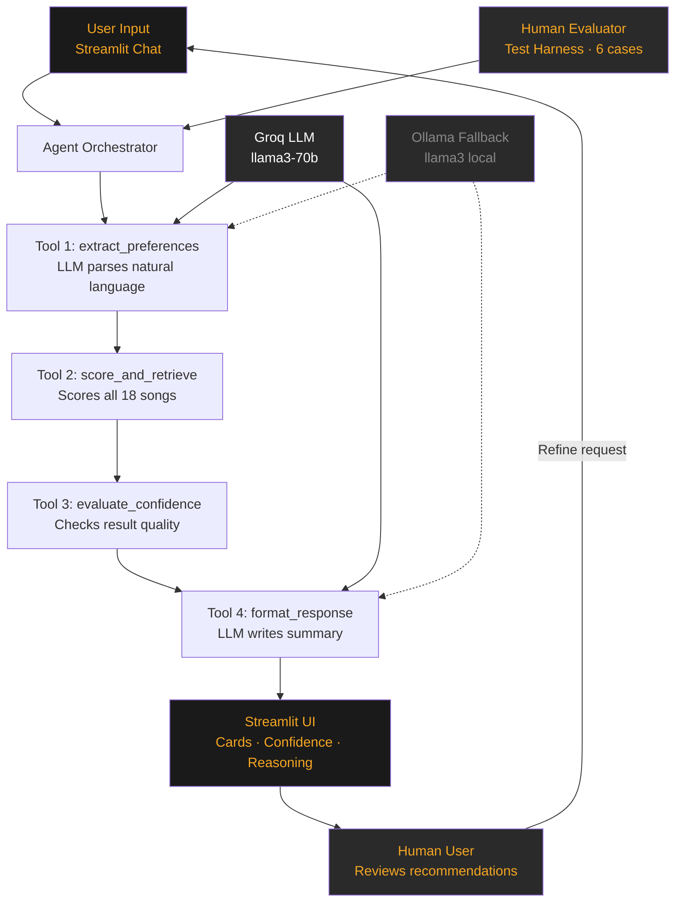

```mermaid
flowchart TD
    A[User Input\nStreamlit Chat] --> B[Agent Orchestrator]
    B --> C[Tool 1: extract_preferences\nLLM parses natural language]
    C --> D[Tool 2: score_and_retrieve\nScores all 18 songs]
    D --> E[Tool 3: evaluate_confidence\nChecks result quality]
    E --> F[Tool 4: format_response\nLLM writes summary]
    F --> G[Streamlit UI\nCards · Confidence · Reasoning]
    G --> H[Human User\nReviews recommendations]
    H -->|Refine request| A
    I[Groq LLM\nllama3-70b] --> C
    I --> F
    J[Ollama Fallback\nllama3 local] -.-> C
    J -.-> F
    K[Human Evaluator\nTest Harness · 6 cases] --> B
    style A fill:#1a1a1a,color:#f5a623
    style G fill:#1a1a1a,color:#f5a623
    style H fill:#2a2a2a,color:#f5a623
    style K fill:#2a2a2a,color:#f5a623
    style I fill:#2a2a2a,color:#ffffff
    style J fill:#2a2a2a,color:#888888
```
